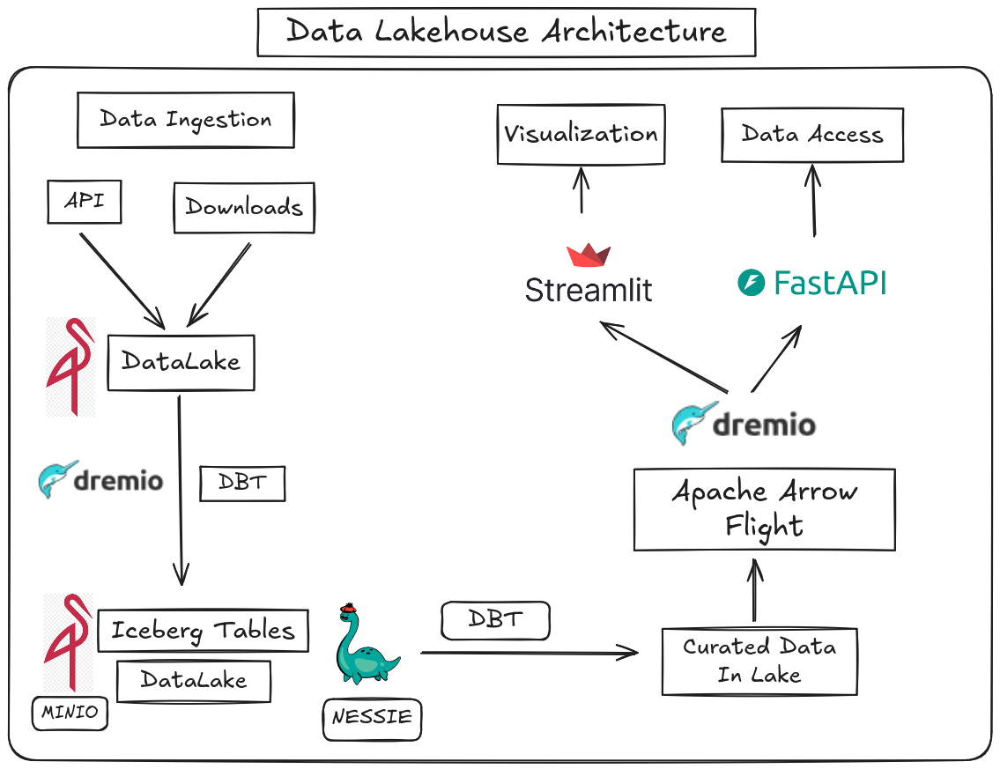

# DE Capstone Project Proposal

## International Trade insights for United States

### Executive Summary

This project aims to analyze and visualize international trade data for the United States, providing actionable insights for policymakers, businesses, and researchers. By leveraging modern data engineering techniques, we will process large datasets, identify key areas of trade, highlight significant trade partners and look for recent trend in data with reference to the implementation of tarrifs on trade partners.

The end product is a dashboard for analytics and a flexible API for stakeholders to access data reliably and accurately.

### Data Sources

- **U.S. Census Bureau International Trade API**: Provides detailed import and export data by country, commodity, and time period.  
  - [API Documentation](https://www.census.gov/data/developers/data-sets/international-trade.html)
  - Classification System of choice:
    - Harmonized System (HS)
  - Data types: Import and Export at
    - Port level
    - State Level
    - District Level
- **World Integrated Trade Solution Rest (WITS) API**
  - [API Documentation](https://wits.worldbank.org/witsapiintro.aspx?lang=en#Trade)
  - United Nations Conference on Trade and Development (UNCTAD) Trade Analysis Information System (Trains) data : Extensive tariff information 
  - Trade Stats - Trade : COUNTRY AND PRODUCT level annual aggregate data
  - Trade Stats - Tariff data: COUNTRY AND PRODUCT level aggregate  tariff (%)

### Project Objectives

- Aggregate and clean international trade datasets from multiple sources.
- Analyze trade flows, trends, and the impact of recent tariff policies.
- Identify top commodities and trading partners for the United States.
- Build interactive dashboards for data visualization.
- Develop a RESTful API for flexible data access.

### Tech Stack and Architecture

- **Data Ingestion & Processing**: Python Scripts, Pandas
- **Data Storage**: MINIO (Raw data lake) in parquet format.
- **Table Format**: Iceberg tables for scalable, reliable, and ACID-compliant data storage and querying
- **Data Transformation & Modeling**: 
  - dbt (Data Build Tool) for version-controlled data transformations ( raw -- staged)
  - Partitioning and bucketing for faster query
- **Dremio** Distributed engine, Reflections aid faster analytics
- **Prefect** Orchestration. Automate the *data ingestion* and transformation
- **API Development**: FastAPI
- **Dashboard Visualization**: Streamlit

### Workflow

The project workflow is divided into two main components:

#### 1. Data Ingestion, Processing, and Transformation

- **Containerized Environment**: All core data engineering tools (MinIO, Dremio, dbt, Prefect) are orchestrated in devcontainer for streamlined deployment and reproducibility.
- **Data Ingestion**: Prefect orchestrates scheduled extraction of raw data from external APIs (U.S. Census, WITS).
- **Raw Data Storage**: Ingested data is stored in MinIO as parquet files, forming the raw data lake.
- **Data Processing & Transformation**: Dremio UI is used as a distributed analytics engine to write raw data into iceberg tables, partition and bucket, create reflections, and DBT-Dremio manages transformations through bronze, silver, and gold layers, ensuring clean, reliable, and analytics-ready tables.

#### 2. API and Dashboard

- **RESTful API**: FastAPI serves as the backend, providing flexible access to processed trade data and analytics.
- **Dashboard Visualization**: Streamlit connects to staged tables, enabling interactive dashboards for stakeholders to explore trade insights.
